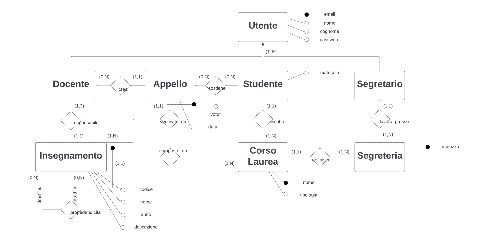
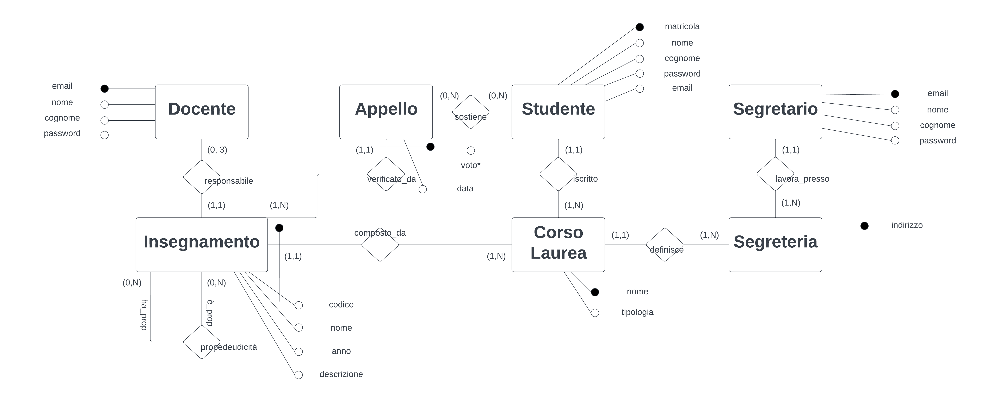

# Documentazione del progetto

## Progettazione concettuale

### Modello ER



La relazione tra appello e studente modella sia l'iscrizione di uno studente ad un appello che il sostenimento di una appello da parte dello studente. Inoltre l'associzione ha un attributo `voto` che se nullo indica che uno studente si è iscritto ad un appello ma la sua prova non è ancora stata valutata.

L'entità **insegnamento** è un entità debole perché, come riportato nelle specifiche, ha un attributo `codice` che è identificato univocamente all'interno del corso di laurea.

Anche l'entità **appello** è un entità debole perché ogni un appello dipende dall'insegnamento di cui sarà la prova. L'attributo data e la relazione con l'entità insegnamento formano l'indentificatore esterno di questa entità.

L'entità **segretario** permette di avere più persone fisiche identificate dalla propria `email` che lavorano presso una **segreteria**. Quest'ultima è caratterizzata da una chiave `indirizzo` come _scienze e tecnologie_, _medicina e chilurgia_, _studi umanistici_ e _scienze motorie_.
Inoltre l'entità segreteria è responsabile, come richiesto dalla specifiche di definire i **corsi di laurea** per questo motivo ho scelto di rappresentare queste entità nel modello relazionale.

Infine la gerarchia utente, studente, docente e segretario ha come scopo quello di rappresentare le caratteristiche in comune alle tre entità che sono `email, nome, cognome e password`. La mail e la password servono per l'accesso e nome e cognome per descrivere l'utente.
La tipologia di gerarichia è totale ed esclusciva, $(T, E)$ perché dato ogni utente esso apparitene ad una e una sola delle classi figlie.

#### Vincoli extra schema
L'attributo `anno` appartiene ad $\{1, 2, 3 \}$ se `tipologia` = _triennale_.
Invece `anno` appartiene ad $\{1, 2 \}$ se `tipologia` = _magistrale_.

L'attributo `voto` è _null_ se lo studente è iscritto al appello ma non ha ancora sotenuto la prova d'esame. Invece dato un appello con voto $v$ se lo studente ha voto $0 \le v < 18$ allora l'appello è insufficiente invece se $18 \le v \le 30$ l'appello è sufficiente.

## Progettazione logica

### Ristrutturazione del modello ER



L'associazione `crea` è ridondante perché riesco a ottenere gli appelli di un docente tramite gli insegnamenti di cui è responsabile, per questo motivo ho scelto di cancellare questa associazione dal modello ER ristrutturato.

Ho scelto di ristrutturare la gerarchia presente nel modello ER accorpando gli attributi dell'entità padre, **utente**, nelle figlie dal momento che la gerarchia è di tipo totale ed esclusivo sopratutto perché ci sono associazioni che coninvolgo le varie entità figlie come evidenziato nel modello ER.

Inoltre ho scelto come identificatore dell'entità **studente** l'attributo `matricola` perché occupa uno spazio in memoria minore rispetto a `mail`.

### Traduzione del modello logico
Si nota che ho utilizzato la <u>sottolineatura</u> per indicare la chiave della relazione, * per attributi potenzialmente nulli e il _corsivo_ per le chiavi esterne.
Traduzione delle entitità con identificatore interno:

**docente**(<u>email</u>, password, nome, cognome)

**studente**(<u>matricola</u>, email, password, nome, cognome, _corso_laurea_)

**segretario**(<u>email</u>, password, nome, cognome, _segreteria_)

**segreteria**(<u>indirizzo</u>)

**corso_laurea**(<u>nome</u>, tipologia, _segreteria_)

Traduzione delle entità con identificatore esterno:

**insegnamento**(<u>corso_laurea, codice</u>, nome, anno, descrizione, _responsabile_*)

**appello**(<u>corso_laurea, codice, data</u>)

Traduzione delle associazioni molti a molti:

**sostiene**(<u>studente, corso, codice, data</u>, voto*)

**propedeuticità**(<u>corso_is, codice_is, corso_has, codice_has</u>)

Traduzione delle associazioni uno a molti:

- aggiunta alla relazione insegnamento la chiave primaria di docente notando che il numero di insegnamento per ogni docente non è arbitrariamente grande ma minore a tre,
- aggiunto alla relazione studente un attributo _corso_laurea_ che contiene il nome del corso di laurea a cui è iscritto,
- aggiunto alla relazione corso_laurea l'attributo segreteria che rappresenta l'id della segrateria che l'ha definita,
- aggiunto alla relazione segretario l'attributo segreteria che rappresenta l'ide della segreteria presso cui lavora.

### Normalizzazione
Oltre alle dipendenze funzionali banali ovvero quelle che ogni attributo ha con la chiave delle propria tabella eccetto la chiave stessa.

## Progettazione fisica
Procedo ora a realizzare lo schema fisico da quello logico utilizzando i comandi SQL di DDL, data definition language.

```sql
create table docente (
	email varchar primary key,
	password varchar not null,
	nome varchar(50) not null,
	cognome varchar(50) not null
);

create table segreteria (
	indirizzo varchar primary key
);

create table segretario (
	email varchar primary key,
	password varchar not null,
	nome varchar(50) not null,
	cognome varchar(50) not null,
	segreteria varchar,
	foreign key (segreteria) references segreteria (indirizzo) on update cascade on delete no action
);

create table corso_laurea (
	nome varchar primary key,
	tipologia char(10) not null,
	segreteria varchar references segreteria (indirizzo) on update cascade on delete no action
);

create table studente (
	matricola char(6) primary key,
	email varchar not null unique,
	password varchar not null,
	nome varchar(50) not null,
	cognome varchar(50) not null,
	corso_laurea varchar references corso_laurea (nome) on update cascade on delete no action
);

create table insegnamento (
	corso_laurea varchar,
	codice char(3),
	nome varchar not null,
	anno char(1) not null,
	descrizione text not null,
	responsabile varchar references docente (email) on update cascade on delete no action,
	primary key(corso_laurea, codice)
);

create table appello (
	corso_laurea varchar,
	codice char(3),
	data date,
	primary key(corso_laurea, codice, data)
);

create table sostiene (
	studente char(6),
	corso_laurea varchar,
	codice char(3),
	data date,
	voto smallint,
	primary key(studente, corso_laurea, codice, data)
);

create table propedeuticita (
	corso_is varchar,
	codice_is char(3),
	corso_has varchar,
	codice_has char(3),
	primary key(codice_is, corso_is, corso_has, codice_has)
);
```

### Politche di reazione di integrità referenziale
Per il vincolo di integrità referenziale sulla tabella studente dal momento che è necessario gestire la cancellazione di studenti in tabelle di storico quindi non è possibile applicare politiche diverse rispetto a quella `no action`.
Invece per quanto riguarda l'aggiornamento delle informazioni di un corso di laurea decido di propagare la modifiche.

Per il vincolo di integrità refernziale della tabella segretario, dal momento che le specifiche non applica particolari restrizioni, decido di propagare le modifiche e annullare le cancellazioni che coinvolgono gli indirizzi della segreteria.

Il vincolo di integrtità referenziale del corso di laurea decido di propagare le modifiche alle tuple del indirizzo della segreteria e di bloccare le cancellazioni.

Infine il vincolo di integrità refernziale della tabella insegnamento decido di propagare le modifiche di un corso di laurea e di impedire le cancellazioni.

### Controllo sul numero massimo di insegnamenti gestiti da docenti
Come richiesto dalle specifiche il numero massimo di insegnamenti gestiti da un docente è 3.
Per controllare che questo vincolo ssia rispetto realizzo un trigger che si occupa di controllare che dopo l'inserimento di un insegnamento il numero di insegnamenti gestiti da un docente sia minore o uguale a 3.

```sql

```

### Controllo anno insegnamenti rispetto alla sua tipologia
Come specificato nei vincoli extra schema del modello relazionale deve valere il seguente vincoli.
L'attributo `anno` di un insegnamento appartiene ad $\{1, 2, 3 \}$ se `tipologia` = _triennale_.
Invece `anno` appartiene ad $\{1, 2 \}$ se `tipologia` = _magistrale_.

```sql

```

## Comportamenti interni alla base di dati
I seguenti requisiti sono realizzati come un comportamento interno alla base di dati.

### Storico della carriera di uno studente
La rimozione di uno studente deve spostare le informazioni dello studente e della sua carriera in apposite tabelle di storico.

Come prima cosa è necessario creare apposite tabelle di storico `str_studente` e `str_sostiene`.

```sql
create table str_studente (
	matricola char(6) primary key,
	email varchar not null unique,
	nome varchar(50) not null,
	cognome varchar(50) not null,
	corso_laurea varchar
);

create table str_sostiene (
	studente char(6),
	corso_laurea varchar,
	codice char(3),
	data date,
	voto smallint,
	primary key(studente, corso_laurea, codice, data)
);
``` 

Per rendere la base di dati capace di questo introduco un trigger che opera prima delle cancellazioni sulla tabella `studente` e che sposta tutti i record sulle informazioni sostenute dallo studente nelle apposite tabelle di storico.

```sql
create or replace function str_studente_carriera() returns trigger as $$
    begin
        insert into str_studente (matricola, email, nome, cognome, corso_laurea) 
        values (old.matricola, old.email, old.nome, old.cognome, old.corso_laurea);

        insert into str_sostiene 
        select *
        from sostiene
        where studente = old.matricola;

		delete
		from sostiene
		where studente=old.matricola;

        return old;
    end;
$$
language 'plpgsql';

create trigger storico_studente_carriera 
before delete on studente
for each row execute function str_studente_carriera();
```

### Inscrizione consentita ad un esame
Realizzazione di un trigger che opera prima dell’inserimento di una tupla. Permette l'inserimento se l’esame è previsto da un corso di laurea e tutte le propedeuticità sono rispettate altrimenti lo blocca.

```sql
create or replace function iscrizione_esami() returns trigger as $$
	declare 
		cois propedeuticita.corso_is%type;
		cdis propedeuticita.codice_is%type;
	begin
		perform *
		from insegnamento 
		where corso_laurea = new.corso_laurea and codice = new.codice;
		
		if found then
			for cois, cdis in
				select corso_is, codice_is 
				from propedeuticita
				where corso_has = new.corso_laurea and codice_has = new.codice
		
			loop 
				if found then 
					perform *
					from sostiene
					where corso_laurea = cois and codice = cdis 
						and studente = new.studente and voto > 17 and data < new.data;

					if not found then
						raise info 'Inserimento non valido, propedeuticità non rispettate!';
						return null;
					end if;
				end if;
			end loop;
		else
			raise info 'Inserimento non valido, insegnamento non registrato!';
			return null;
		end if;

		return new;
end;
$$ language 'plpgsql';

create trigger gestione_iscrizione_esami
before insert on sostiene
for each row execute function iscrizione_esami();
```

Inizialmente la procedura controlla se il codice e il corso di laurea fanno parte del corso di laurea presenti, poi controlla le propedeuticità.
Se non sono presenti tutte le propedeuticità con voto sufficiente permette blocca l'inserimento sollevando un messaggio di errore altrimenti permette l'inserimento dell'esame.

### Gestione data appelli esami
Non è possibile avere due appelli per esami dello stesso anno nello stesso giorno.

Per realizzare questo comportamento all'interno della base di dati realizzo un trigger che opera prima dell'inserimento nella tabella `appello`.
Per recuperare l'anno dell'insegnamento devo fare un join con la tabella `insegnamento` per trovare l'anno del corso di laurea in cui è erogato.
Se esistono appelli dello stesso anno con la stessa data devo bloccare la possibilità di inserimento altrimenti può essere inserito.

```sql
create or replace function appelli_esami() returns trigger as $$
	declare
		anno_esame insegnamento.anno%type;
	begin
		select i.anno into anno_esame 
		from appello a inner join insegnamento i on a.corso_laurea = i.corso_laurea and a.codice = i.codice
		where a.corso_laurea = new.corso_laurea and a.codice = new.codice;
		
		perform *
		from insegnamento i inner join appello a on a.corso_laurea = i.corso_laurea and a.codice = i.codice
		where i.corso_laurea = new.corso_laurea and i.anno = anno_esame and data = new.data;
		
		if found then
			raise info 'Impossibile inserire registrare il nuovo appello per una sovrapposizione!';
			return null;
		else
			return new;
		end if;
	end;
$$ language 'plpgsql';

create trigger gestione_appelli_esami 
before insert on appello
for each row execute function appelli_esami();
```

### Produzione carriera completa di uno studente iscritto
Per avere la `carriera_completa` di uno studente decido di realizzare una vista con tutte le infomrazioni riguardo la carriera di uno studente recuperando informazioni da `insegnamento`, `appello`, `sostiente`.

```sql
create or replace view carriera_completa as (
	select s.studente, i.nome, a.corso_laurea, i.anno, a.data, s.voto
	from appello a inner join sostiene s on a.corso_laurea = s.corso_laurea and a.codice = s.codice and a.data = s.data
		inner join insegnamento i on a.corso_laurea = i.corso_laurea and a.codice = i.codice
	order by anno asc
);
```

### Produzione carriera valida di uno studente iscritto
In modo analogo al precedente per ottenere la carriera valida realizzo una vista `carriera_valida` che contiene solo la descrizione degli esami sufficienti e con la data più recente.

```sql
create or replace view carriera_valida as (
	with esami_recenti as (
		select studente, nome, corso_laurea, anno, max(data) as data_recente
		from carriera_completa
		where voto > 17
		group by studente, nome, corso_laurea, anno
	)
	select e.studente, e.nome, e.corso_laurea, e.anno, e.data_recente, c.voto
	from esami_recenti e inner join carriera_completa c on e.studente = c.studente and e.nome = c.nome and e.corso_laurea = c.corso_laurea and e.data_recente = c.data
);
```

### Informazioni complete di un corso di laurea
Per recupeare le infomrazioni rigurado un corso di laurea servono anche tutte le infromazioni riguardo gli insegnamenti di quel corso di laurea.
Per rappresentare queste informazioni ho scelto di realizzare una funzione che prende in input il nome di un corso di laurea e restituisce tutte le informazioni ad esso riguardanti.

```sql
create or replace function descrizione_corso_laurea(varchar) returns text as $$
	declare
		descrizione text = '';
		corso corso_laurea%rowtype;
		ins insegnamento%rowtype;
	begin
		select * into corso
		from corso_laurea
		where trim(lower(nome)) = trim(lower($1));

		if not found then
			descrizione = 'Nome del cordo non trovato!';
		else 
			descrizione = descrizione || 'Nome corso di laurea: ' || corso.nome 
				|| ', tipologia: ' || corso.tipologia || ', facoltà: ' || corso.segreteria || E'\n';
			for ins in 
				select *
				from insegnamento
				where trim(lower(nome)) = trim(lower($1))
				order by anno asc
			loop
				descrizione = descrizione || 'nome esame: ' || ins.nome 
					|| ', anno di erogazione : ' || ins.anno  || ', descrizione: ' || ins.descrizione
					|| ', responsabile: ' || ins.responsabile || E'\n';
			end loop; 
		end if;
		return descrizione;
	end;
$$ language 'plpgsql';
```